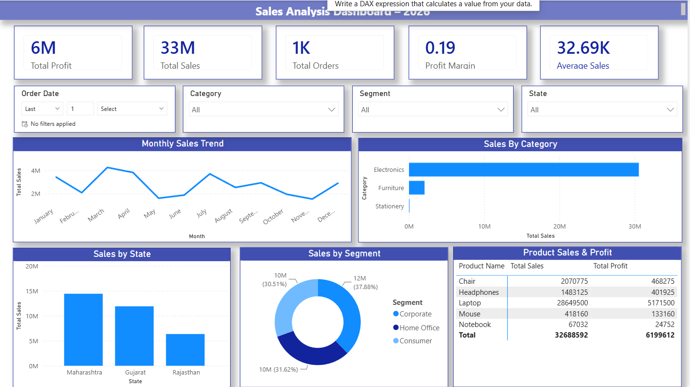

# 📊 Sales Analysis Dashboard | Power BI

> **An Interactive Power BI Dashboard for Analyzing Sales Performance, Profitability, Customer Segments, and Business Trends.**

---

## 📌 Project Overview

The **Sales Analysis Dashboard** is an interactive Business Intelligence (BI) solution developed using **Microsoft Power BI**. It helps businesses analyze sales performance, profitability, customer segments, and regional trends through dynamic visualizations and interactive filters.

This dashboard provides meaningful insights into key business metrics, enabling organizations to make data-driven decisions efficiently.

---

## 🎯 Project Objectives

- Analyze overall sales and profit performance.
- Monitor monthly sales trends.
- Compare sales across different product categories.
- Evaluate sales performance by state.
- Analyze customer segments.
- Identify top-performing products.
- Support business decision-making using interactive dashboards.

---

## 🛠️ Tech Stack

| Technology | Purpose |
|------------|---------|
| **Microsoft Power BI** | Dashboard Development |
| **Power Query** | Data Cleaning & Transformation |
| **DAX (Data Analysis Expressions)** | KPI Calculations & Measures |
| **Microsoft Excel** | Data Source |
| **Data Modeling** | Building Relationships Between Tables |

---

## 📂 Data Source

**Source:** Microsoft Excel Dataset

### Dataset Includes

- Order Date
- Product Name
- Category
- Segment
- State
- Sales
- Profit
- Quantity

---

## ✨ Dashboard Features

### 📌 KPI Cards

- 💰 Total Sales
- 💵 Total Profit
- 📦 Total Orders
- 📈 Profit Margin
- 📊 Average Sales

---

### 🎛️ Interactive Filters

- 📅 Order Date
- 🛍️ Category
- 👥 Segment
- 📍 State

---

### 📈 Visualizations

- 📈 Monthly Sales Trend (Line Chart)
- 📊 Sales by Category (Bar Chart)
- 📍 Sales by State (Column Chart)
- 🍩 Sales by Segment (Donut Chart)
- 📋 Product Sales & Profit (Table)

---

## 📊 Key Business Insights

- Identify top-selling products.
- Compare sales performance across different states.
- Analyze customer segment contribution.
- Track monthly sales growth.
- Evaluate overall business profitability.
- Monitor business KPIs in real time.

---

## 📷 Dashboard Preview

> **Sales Analysis Dashboard**



> **Note:** Place your dashboard screenshot as **Dashboard.png** inside the GitHub repository.

---

## 📈 Dashboard Overview

The dashboard consists of:

- ✅ 5 KPI Cards
- ✅ 4 Interactive Filters
- ✅ 5 Business Visualizations
- ✅ Responsive Dashboard Layout
- ✅ Clean and Professional UI
- ✅ Interactive Data Exploration

---

## 🚀 Getting Started

### 1️⃣ Clone the Repository

```bash
git clone https://github.com/YOUR_USERNAME/Sales-Analysis-Dashboard.git
```

### 2️⃣ Open the Project

Open the **Sales Analysis Dashboard.pbix** file using **Sales_Data.xlsx**.

### 3️⃣ Refresh the Dataset

If required, refresh the dataset to load the latest data.

### 4️⃣ Explore the Dashboard

Use the slicers and filters to analyze sales performance interactively.

---

## 📚 Skills Demonstrated

- Data Cleaning
- Data Transformation
- Data Modeling
- DAX Calculations
- KPI Design
- Business Intelligence
- Dashboard Design
- Data Visualization
- Power Query
- Analytical Thinking

---

## 📌 Key Metrics

| Metric | Description |
|--------|-------------|
| Total Sales | Overall revenue generated |
| Total Profit | Total business profit |
| Total Orders | Number of orders placed |
| Average Sales | Average sales value |
| Profit Margin | Overall profitability ratio |

---

## 📈 Business Benefits

✔️ Monitor overall business performance.

✔️ Identify profitable products.

✔️ Compare regional sales performance.

✔️ Analyze customer purchasing behavior.

✔️ Support strategic business decisions.

✔️ Improve sales performance through data-driven insights.

---

## 🔮 Future Enhancements

- Customer Analysis Dashboard
- Sales Forecasting
- Year-over-Year Comparison
- Profit Trend Analysis
- Drill-Through Reports
- Dynamic Tooltips
- Mobile Optimized Dashboard
- Real-Time Data Integration

---

## 👨‍💻 Author

**Zeel Vekariya**

🎓 ICT Student

📊 Aspiring Data Analyst

💼 Power BI Developer

🚀 Passionate about Business Intelligence, Data Analytics, AI & Data Visualization

---

## ⭐ Support

If you found this project useful, please consider giving it a **⭐ Star** on GitHub.

It helps support my work and motivates me to build more Data Analytics projects.

---

# ⭐ Thank You for Visiting This Repository!
